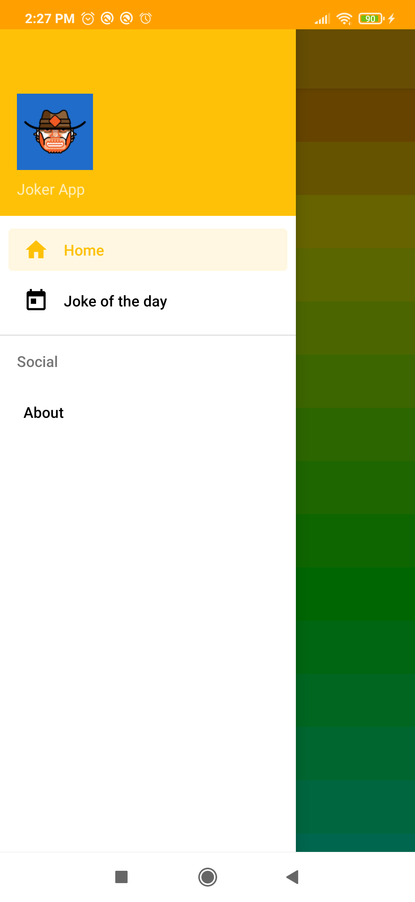
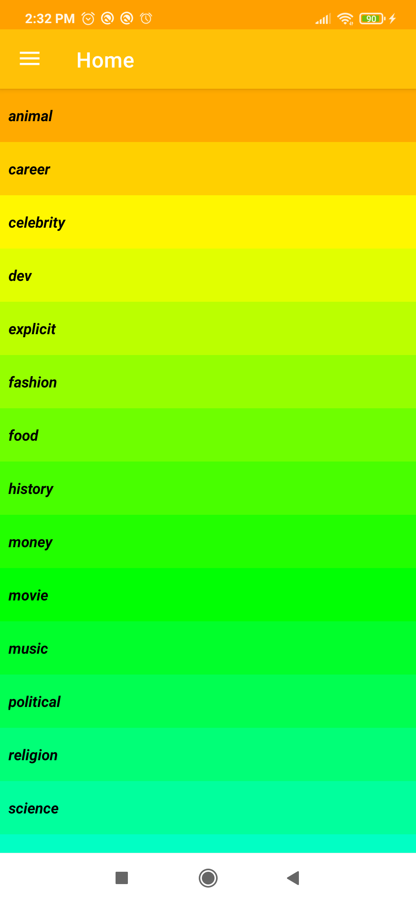
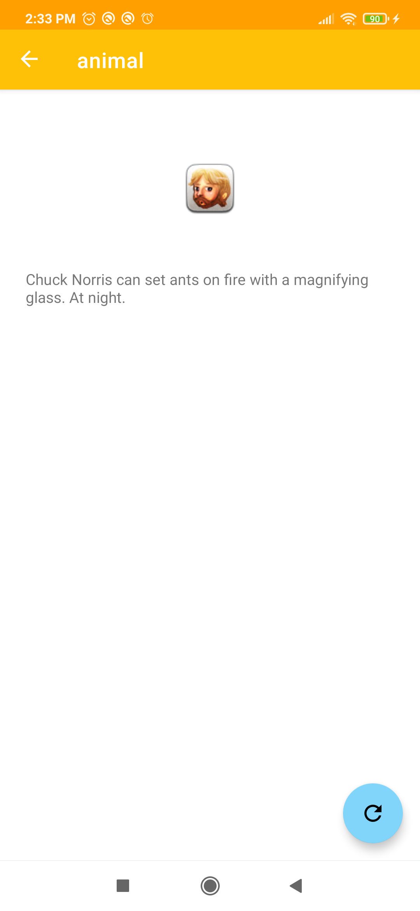
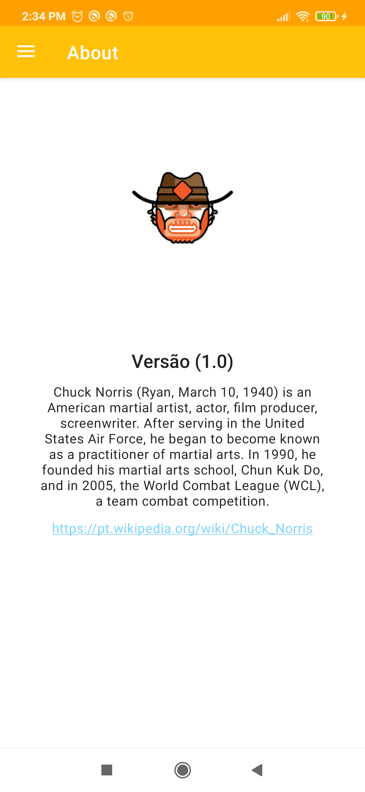
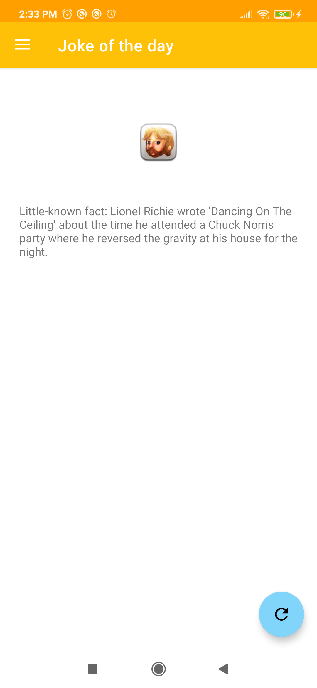
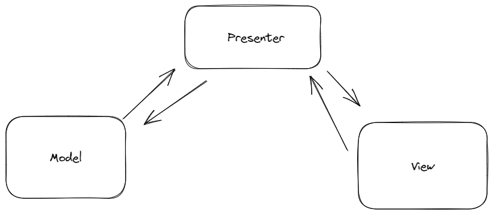

<h1 align="center">Joker App</h1>

<p align="center">
  LiCENSE TAG <a href="https://opensource.org/licenses/Apache-2.0"></a>
  <a href="https://android-arsenal.com/api?level=21"></a>
  <br>
  <a href="https://wa.me/+5521990940822"></a>
  <a href="https://www.linkedin.com/in/marcosmendesrj/"></a>
  <a href="mailto:marcosmendesinfo@gmail.com"></a>
</p>


<p align="center">  

⭐ This is a project to demonstrate my technical knowledge in native Android development with Kotlin. More technical information below.

Application of jokes in relation to the famous actor Chuck Norris. An app focused on the MVP architecture, 
using fragments and navigation features to make the app look more professional. With a custom launcher, splash screen,
HTTP request with Retrofit to bring categories of jokes that are in a database. Enveloping fragments with a single activity to make the app more fluid navigable.
Images with caching system, and more.

</p>

</br>

<p float="left" align="center">





</p>

Download the <a href="apk/app-debug.apk?raw=true">APK directly</a>. You can see <a href="https://www.google.com/search?q=how+to+install+an+apk+on+android">here</a> how to install an APK in your android device.

## technologies and open source libraries

- Minimum SDK level: 21
- [Kotlin Language](https://kotlinlang.org/)

- Jetpack 
  - Lifecycle: Observe Android lifecycles and handle UI states after lifecycle changes.
  - Navigation: Fragment transaction processing, the providing standardized resources for animations and transitions, and more.
  - Custom Views: View customizadas feitas do zero usando XML.
  - [...]

- Architecture
  - MVP (Model - View - Presenter)
  
- Libraries 
  - [Retrofit2 & OkHttp3](https://github.com/square/retrofit): To perform requests following the HTTP standard.
  - [Picasso](https://github.com/square/picasso): For loading images and caching them.
  - [Groupie](https://github.com/lisawray/groupie): For complex RecyclerView layouts.
  - [...]

</br></br>

<br>

## Third-party API

Joker App uses a private API https://api.tiagoaguiar.co/jokerapp/jokes/categories for your REST calls.

# License

```xml
Copyright [2023] [Marcos Mendes]

   Licensed under the Apache License, Version 2.0 (the "License");
   you may not use this file except in compliance with the License.
   You may obtain a copy of the License at

     http://www.apache.org/licenses/LICENSE-2.0

   Unless required by applicable law or agreed to in writing, software
   distributed under the License is distributed on an "AS IS" BASIS,
   WITHOUT WARRANTIES OR CONDITIONS OF ANY KIND, either express or implied.
   See the License for the specific language governing permissions and
   limitations under the License.
```
